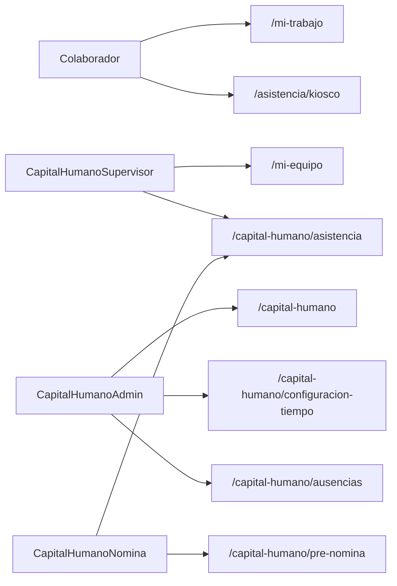
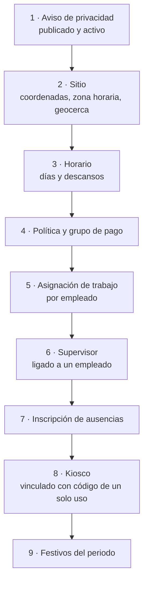
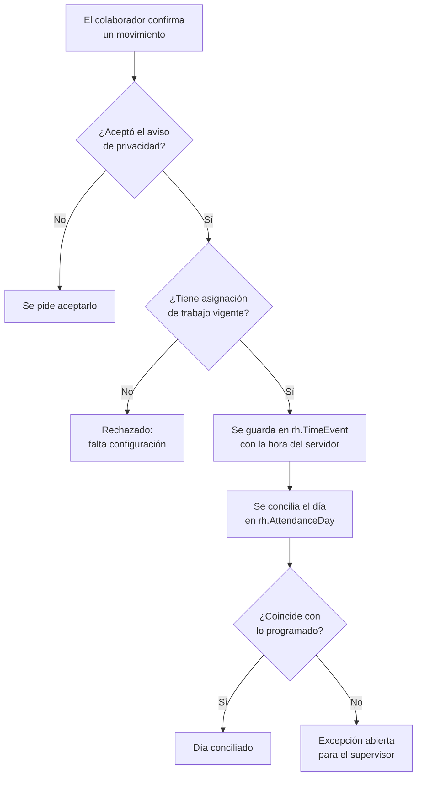
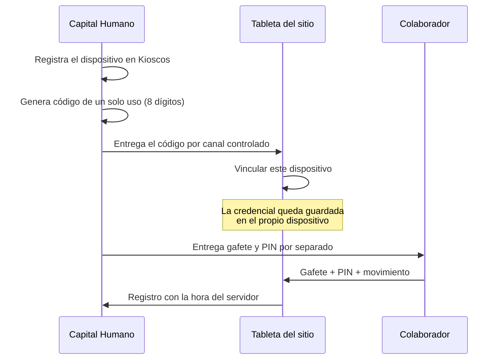
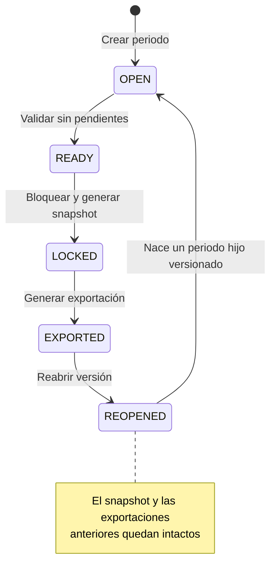

# Manual de uso: Capital Humano

## Propósito del módulo

Capital Humano cubre el ciclo de asistencia de la empresa: el colaborador registra
su entrada y salida, el supervisor resuelve lo que quedó fuera de lo esperado, y
nómina cierra un periodo y exporta un archivo con las unidades de tiempo ya
validadas. El expediente de personal (`/capital-humano`) es la base: todo lo demás
cuelga de `dbo.Capital_Humano` y del esquema `rh`.

Conviene decir desde el principio lo que **no** hace, porque marca dónde termina el
sistema y empieza el proceso de nómina externo: no calcula impuestos, IMSS, salario
neto ni finiquitos; no emite CFDI de nómina; no evalúa desempeño; no se conecta con
relojes checadores biométricos o de tarjeta; y los horarios son semanales fijos, sin
rotación de turnos. Lo que entrega es un XLSX y un ZIP de CSV para que quien procesa
la nómina los cargue en su propio sistema.

## Quién ve qué

| Rol | Pantallas | Para qué |
| --- | --- | --- |
| Colaborador (usuario ligado a un empleado) | `/mi-trabajo`, `/asistencia/kiosco` | Registrar, consultar, pedir correcciones y solicitar ausencias |
| `CapitalHumanoSupervisor` | `/mi-equipo`, `/capital-humano/asistencia` | Resolver excepciones y aprobar a su equipo |
| `CapitalHumanoAdmin` | Todas, más `/capital-humano` y `/capital-humano/configuracion-tiempo` | Configurar y administrar |
| `CapitalHumanoNomina` | `/capital-humano/pre-nomina`, `/capital-humano/asistencia` | Cerrar y exportar periodos |

`Administrador` conserva acceso de anulación sobre todo el módulo.

## Antes de empezar: el orden de configuración

El orden no es decorativo. Cada paso depende del anterior, y si se saltan, el
registro falla con un mensaje que parece un error del sistema pero es configuración
faltante. Todo esto vive en `/capital-humano/configuracion-tiempo`, en las pestañas
`Preparación`, `Sitios`, `Horarios`, `Asignaciones`, `Supervisores`,
`Políticas y pago`, `Festivos`, `Kioscos` y `Privacidad`.

1. **Acceso del colaborador.** En `/admin/seguridad`, liga cada usuario a la empresa
   y captura su `EmployeeId`. Sin ese dato el sistema no emite el permiso interno y
   `/mi-trabajo` le queda cerrado, aunque el usuario exista y tenga contraseña. Es
   la causa más común de "no me aparece el menú".
2. **Aviso de privacidad.** Redáctalo, publícalo y actívalo. Va primero porque el
   registro pide ubicación y el colaborador debe poder aceptarlo antes.
3. **Sitio.** Captura las coordenadas confirmadas en campo, la zona horaria y el
   radio de la geocerca. No lo deduzcas del texto heredado de sucursal.
4. **Horario**, **política de asistencia y horas extra**, y **grupo de pago**
   (`SEMANAL`, `QUINCENAL` o `MENSUAL`).
5. **Asignación de trabajo** por empleado, y **supervisor**. Un supervisor debe estar
   ligado a un empleado antes de poder consultar o aprobar a su equipo.
6. **Inscripción de ausencias** (vacaciones con acumulación `MEXICO_STATUTORY`).
7. **Kiosco**, si se va a usar. Ver la sección correspondiente.
8. **Festivos** del periodo.

La pestaña `Preparación` es la lista de verificación: muestra empleado por empleado
si ya tiene `Acceso`, `Asignación` y `Supervisor`, y marca `Listo` o
`Requiere configuración`. Úsala como semáforo antes de abrir el primer periodo.

## Uso diario del colaborador

En `/mi-trabajo` el colaborador ve su `Estado actual`, su `Horario`, sus
`Registros recientes`, sus `Saldos de ausencia` y sus `Excepciones abiertas`.

Los cuatro movimientos son `Entrada`, `Inicio descanso`, `Fin descanso` y `Salida`.

- El registro usa la **hora del servidor**, no la del navegador. El reloj del equipo
  se muestra sólo como referencia.
- La **ubicación se pide únicamente al confirmar** el movimiento. No hay seguimiento
  continuo. La ubicación exacta se guarda cifrada y se anonimiza a los 730 días.
- La primera vez aparece el aviso de privacidad con la casilla
  `He leído y acepto el aviso`. Sin aceptarlo no se puede registrar.

**Si el colaborador se equivoca o se le olvida registrar**, no se borra ni se corrige
el evento original: se usa `Enviar a supervisor` para solicitar una corrección,
indicando `Fecha y hora` y `Motivo`. El supervisor la acepta o la devuelve, y queda
un evento nuevo auditado. Los registros originales nunca se reescriben.

**Para pedir vacaciones o permiso**, usa `Enviar solicitud` con el tipo, las fechas y
el motivo. `Días disponibles` muestra el saldo.

## El kiosco

El kiosco (`/asistencia/kiosco`) sirve para registrar en sitio desde una tableta
compartida, sin que cada persona inicie sesión. Es una página web: no requiere
hardware especial, pero tampoco sustituye a un reloj checador biométrico, que este
sistema no maneja.

El registro es de dos pasos a propósito: primero se elige el movimiento y después
se confirma. **Ningún movimiento viene preseleccionado**, el botón de confirmar
permanece deshabilitado hasta que se elige uno, y una vez elegido el botón dice
exactamente qué va a enviar (`Confirmar Inicio descanso`). Al terminar cada
registro el kiosco se limpia por completo: gafete, PIN y movimiento. Es
deliberado, porque el kiosco lo comparte todo el personal y una selección que se
quedara pegada haría que la siguiente persona marcara con el movimiento de la
anterior.

Puntos que conviene cuidar en la operación:

- El código de vinculación es de **un solo uso** y expira. Si alguien lo gasta por
  error, genera otro desde `Kioscos`.
- Gafetes y PIN se entregan **por un canal controlado**, y por separado. No los
  mandes por chat ni por correo masivo.
- A los **5 intentos fallidos de PIN**, la credencial se bloquea 15 minutos. Es
  deliberado; no es una falla.
- Si el kiosco responde `Este kiosco no pertenece al sitio asignado al empleado`, la
  asignación de trabajo de esa persona apunta a otro sitio.
- En producción el kiosco exige HTTPS.

## El supervisor

En `/mi-equipo` el supervisor ve `Personas trabajando ahora` y trabaja cuatro colas:

- **Excepciones**: días que no cuadraron. Se resuelven con `Aprobar` o `Devolver`.
- **Correcciones solicitadas**: la `Hora solicitada` y el motivo que capturó el
  colaborador. `Aprobar` genera el evento corregido; `Devolver` lo regresa.
- **Calendario y horas extra**: la `Extra candidata` que detectó el sistema requiere
  una `Decisión` explícita. Mientras haya decisiones pendientes el periodo no cierra.
- **Aprobaciones para pre-nómina**: `Aprobar asistencia` por empleado. Es el visto
  bueno que nómina necesita para poder bloquear.

El sistema valida el alcance del supervisor del lado del servidor: aunque se escriba
la ruta a mano, sólo verá a la gente que tiene asignada.

## Cierre de pre-nómina

En `/capital-humano/pre-nomina`, con `Nuevo periodo` se elige `Grupo de pago`,
`Desde` y `Hasta`, y se usa `Crear periodo`. Después:

1. **`Validar`** lista lo que falta. Es la pantalla que hay que leer con calma.
2. **`Aprobar empleado`** para los que ya estén listos.
3. **`Bloquear`** congela el periodo y genera el snapshot.
4. **`Generar exportación`**, y luego `Descargar XLSX` o `Descargar CSV ZIP`.

El bloqueo **falla a propósito** si falta una asignación, si hay una excepción o una
ausencia pendiente, si algún día sigue sin conciliar, si hay tiempo extra candidato
sin decisión, o si falta la aprobación del supervisor. No es un error: es la lista de
pendientes.

`Reabrir versión` no modifica lo ya cerrado: crea un periodo hijo versionado y deja
el snapshot y las exportaciones previas tal cual, para que siempre se pueda explicar
qué se entregó y cuándo.

El XLSX trae las hojas `Resumen`, `Detalle`, `HorasExtra`, `Incidencias`, `Ausencias`
y `Validaciones`. El ZIP trae los CSV equivalentes en UTF-8 más un `manifest.json`.
De ambos se guarda el archivo y su hash SHA-256, así que se puede comprobar después
que el archivo entregado es el mismo que generó el sistema.

## Ausencias

En `/capital-humano/ausencias` se administran `Tipos activos`, `Políticas efectivas`,
`Inscripciones`, `Solicitudes`, `Ajuste de saldo` y `Acumulación de vacaciones`.

Los tipos sembrados son `VACACIONES`, `INCAPACIDAD`, `PERSONAL` y `SIN_GOCE`. La
política `MX-VACACIONES` usa acumulación `MEXICO_STATUTORY`.

Los ajustes de saldo se registran con motivo y quedan auditados; no se editan saldos
directamente.

## Aislamiento entre empresas

El esquema `rh` tiene seguridad a nivel de fila: cada consulta queda acotada al RFC
de la sesión, de modo que una empresa no puede ver datos de otra aunque una consulta
olvide filtrar. El kiosco es la excepción deliberada: como la tableta no inicia
sesión, el dispositivo se identifica por el hash de su token y, una vez resuelto, la
conexión queda acotada al RFC de ese dispositivo.

Es una red de seguridad adicional, no un sustituto de los permisos: la validación de
RFC y de alcance de equipo sigue viviendo también en el servicio.

## Preguntas frecuentes

**"No me aparece Capital Humano en el menú."** Falta el rol
(`CapitalHumanoAdmin`, `CapitalHumanoSupervisor` o `CapitalHumanoNomina`) o, para
`/mi-trabajo`, falta ligar el usuario a su `EmployeeId` en `/admin/seguridad`.

**"El empleado no tiene una asignación de trabajo vigente."** No es una falla del
registro: falta el paso 5 de la configuración para esa persona.

**"El código expiró o ya fue utilizado."** Los códigos de kiosco son de un solo uso.
Genera otro desde la pestaña `Kioscos`.

**"El periodo todavía no está listo."** Lee la lista que aparece debajo: es el
inventario exacto de lo que falta aprobar o decidir.

**¿Se pueden borrar registros?** No. Los eventos originales no se eliminan ni se
reescriben; toda corrección agrega un evento auditado. Es lo que permite sostener el
dato frente a una revisión.
